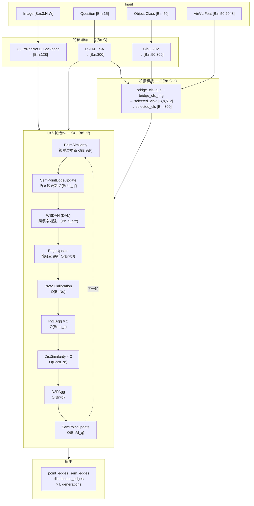

# BPCIN 模型迭代更新时间复杂度分析

## 1. 项目概述

**BPCIN (Bigraph Proto-calibration Cross-modal Inference Network)** 是一个面向 **Few-Shot Visual Question Answering (FSVQA)** 的模型。其核心思想是在元学习 (meta-learning) 的 episode 训练框架下，构建 **双图 (Bigraph)** 结构 —— 即 **Point Graph（实例图）** 与 **Distribution Graph（分布图）** —— 并通过多轮迭代交互更新，逐步细化样本间的关系和类别分布，从而进行少样本条件下的 VQA 分类。

> [!NOTE]
> 本项目同时还引入了 **语义子图 (Semantic Point/Distribution Graph)** 和 **DAL (Dual Attention Layer)** 交叉注意力增强模块，形成一个多分支、多模态的图推理框架。

---

## 2. 关键符号定义

| 符号 | 含义 | 典型值 |
|------|------|--------|
| `N` | num_ways（类别数） | 5 或 10 |
| `K` | num_shots（每类支持样本数） | 1 或 5 |
| `Q` | num_queries（每类查询样本数） | 1 |
| `n = NK + NQ` | 每个 episode 中样本总数 | 10 (5-way 1-shot) 或 30 (5-way 5-shot) |
| `n_s = NK` | 支持集样本数 | 5 或 25 |
| `B` | batch_size（并行 episode/task 数） | 10~25 |
| `d` | 视觉嵌入维度 | 128 |
| `d_q` | 问题/语义嵌入维度 | 300 |
| `d_v` | VinVL 对象特征维度 | 2048 |
| `d_c` | CLIP 节点映射维度 | 512 |
| `O` | 每个样本的对象提议数 (VinVL objects) | 50 |
| `L_q` | 问题 token 长度 | 15 |
| `L` | 双图迭代轮数 (generation) | **6** |
| `h` | 注意力头数 | 4 或 8 |
| `d_att` | 注意力隐层维度 | 512 或 1024 |

---

## 3. 单次迭代 (single training step) 的完整计算流水线

每个训练 step 处理 `B` 个 episode，每个 episode 包含 `n = NK + NQ` 个样本。

### 3.1 Backbone 特征提取

对 `B × n` 个图像进行编码（CLIP RN50 或 ResNet12）。

- **CLIP RN50**：前向推理冻结参数，产出 last layer `[Bn, 2048, 7, 7]` → AvgPool + Linear → `[Bn, 128]`，以及 second last `[Bn, 1024, 14, 14]` → MaxPool + Linear → `[Bn, 128]`
- 主体计算量来自 ResNet50 的卷积（冻结，不参与梯度计算）
- 最终输出：`last_layer_data [B, n, d]`, `second_last_layer_data [B, n, d]`

> 复杂度：$O(Bn \cdot C_{backbone})$，其中 $C_{backbone}$ 是 backbone 的前向常数。冻结参数无反向传播开销。

### 3.2 Question Encoder（问题编码器）

对 `B × n` 个问题进行编码：
1. **Embedding**: `[Bn, L_q]` → `[Bn, L_q, 300]`：$O(Bn \cdot L_q \cdot d_q)$
2. **LSTM**: `[Bn, L_q, 300]` → `[Bn, L_q, 512]`：$O(Bn \cdot L_q \cdot d_{att}^2)$（其中 $d_{att}=512$）
3. **Self-Attention (SA)**: 多头注意力 $O(Bn \cdot L_q^2 \cdot d_{att})$
4. **Linear**: `[Bn, L_q × 512]` → `[Bn, 300]`：$O(Bn \cdot L_q \cdot d_{att} \cdot d_q)$

> 小计：$O(Bn \cdot L_q \cdot d_{att}^2)$（LSTM 项主导）

### 3.3 Cls Encoder（对象类别编码器）

对 `B × n` 个样本的 50 个对象类别标签编码：
1. **Embedding + LSTM**: `[Bn × 50, tokens, 300]` → `[Bn × 50, 512]`
2. **Linear**: `[Bn × 50, 512]` → `[Bn × 50, 300]`

> 小计：$O(Bn \cdot O \cdot d_{att}^2)$

### 3.4 Bridge (cls-que-img 桥接)

#### bridge_cls_que：

- 对每个样本，计算 $O$ 个对象与问题的余弦相似度，取 Top-15
- 复杂度：$O(Bn \cdot O \cdot d_q)$

#### bridge_cls_img：

- 用 Top-15 索引 gather VinVL 特征并求和 + Linear(2048→512)
- 复杂度：$O(Bn \cdot 15 \cdot d_v + Bn \cdot d_v \cdot d_c)$

### 3.5 初始化边 (init_edge)

`init_edge` 用余弦相似度初始化边矩阵，对 `n` 个节点两两计算：

$$O(B \cdot n^2 \cdot d)$$

---

### 3.6 ⭐ 核心迭代更新 — L 轮 Generation 循环

这是模型最核心的部分，**循环 $L=6$ 次**，每轮包含以下操作：

#### (a) PointSimilarity — 视觉实例图边更新

1. 差值计算：`vp_i - vp_j` → `[B, n, n, d]`：$O(B \cdot n^2 \cdot d)$
2. Conv2d 网络 (128→256→128→1)：在 `[B, d, n, n]` 上做 1×1 卷积
   - Conv1: $O(B \cdot n^2 \cdot d \cdot 2d)$
   - Conv2: $O(B \cdot n^2 \cdot 2d \cdot d)$
   - Conv3: $O(B \cdot n^2 \cdot d)$
   - 合计：$O(B \cdot n^2 \cdot d^2)$
3. 归一化：$O(B \cdot n^2)$

> 单轮小计：$O(B \cdot n^2 \cdot d^2)$

#### (b) SemPointEdgeUpdate — 语义图边更新

与 PointSimilarity 结构相同，但特征维度为 $d_q=300$：

> 单轮小计：$O(B \cdot n^2 \cdot d_q^2)$

#### (c) DAL (WSDAN) — 跨模态增强

执行 2 层交叉注意力 (Cross-Attention)：
- 输入映射 `Linear(512→1024)`
- 每层：Cross-Attention $O(B \cdot n^2 \cdot d_{att}) + $ FFN $O(B \cdot n \cdot d_{att}^2)$
  - 其中 $d_{att}=1024$
- 2 层总计：$O(B \cdot n^2 \cdot d_{att} + B \cdot n \cdot d_{att}^2)$

> 单轮小计：$O(B \cdot n \cdot d_{att}^2)$（FFN 项主导，因为 $d_{att}=1024 \gg n$）

#### (d) EdgeUpdate — 增强节点边更新

结构同 PointSimilarity：$O(B \cdot n^2 \cdot d^2)$

#### (e) get_proto_node_with_query — 原型校准

1. 从边矩阵中取 argmax 找对齐的 query：$O(B \cdot NQ \cdot n_s)$
2. 原型拼接和平均：$O(B \cdot N \cdot K \cdot d)$

> 单轮小计：$O(B \cdot n \cdot n_s)$

#### (f) get_proto_distribution — 原型分布计算

- 对 `n` 个样本分别与 `N` 个原型做余弦相似度
- 复杂度：$O(B \cdot n \cdot N \cdot d)$

#### (g) P2DAgg / LinearTransformation — 点图→分布图节点更新

- `cat + Linear(n→n_s)`：$O(B \cdot n \cdot n_s)$

#### (h) DistributionSimilarity — 分布图边更新

与 PointSimilarity 类似，但特征维度为 $n_s$（=5）：
- Conv2d (5→10→5→1)：$O(B \cdot n^2 \cdot n_s^2)$

> 单轮小计：$O(B \cdot n^2 \cdot n_s^2)$

#### (i) D2PAgg — 分布图→点图节点更新

1. `bmm(edge, node)`：$O(B \cdot n^2 \cdot d)$
2. `cat + Conv2d (256→256→128)`：$O(B \cdot n \cdot d^2)$

> 单轮小计：$O(B \cdot n^2 \cdot d)$

#### (j) SemPointUpdate — 语义图节点更新

1. 2 次 `bmm(edge, node)`：$O(B \cdot n^2 \cdot d_q)$
2. `cat + Conv2d (600→600→300)`：$O(B \cdot n \cdot d_q^2)$

> 单轮小计：$O(B \cdot n^2 \cdot d_q)$

---

### 3.7 单轮 Generation 汇总

| 子模块 | 复杂度 |
|--------|--------|
| PointSimilarity (视觉边) | $O(B n^2 d^2)$ |
| SemPointEdgeUpdate (语义边) | $O(B n^2 d_q^2)$ |
| WSDAN (DAL 跨模态) | $O(B n \cdot d_{att}^2)$ |
| EdgeUpdate (增强边) | $O(B n^2 d^2)$ |
| ProtoNode + ProtoDistribution | $O(B n N d)$ |
| P2DAgg × 2 | $O(B n \cdot n_s)$ |
| DistributionSimilarity × 2 | $O(B n^2 n_s^2)$ |
| D2PAgg | $O(B n^2 d)$ |
| SemPointUpdate | $O(B n^2 d_q)$ |

**每轮主导项**：

$$T_{gen} = O\big(B n^2 (d^2 + d_q^2) + B n \cdot d_{att}^2\big)$$

### 3.8 L 轮叠加

$$T_{L\_gen} = L \cdot T_{gen} = O\big(L \cdot B n^2 (d^2 + d_q^2) + L \cdot B n \cdot d_{att}^2\big)$$

---

## 4. 总时间复杂度

$$\boxed{T_{iter} = O\big(Bn \cdot C_{backbone} + Bn \cdot L_q \cdot d_{att}^2 + L \cdot B n^2 (d^2 + d_q^2) + L \cdot B n \cdot d_{att}^2\big)}$$

### 代入典型值分析（5-way 1-shot 场景）

| 参数 | 值 |
|------|-----|
| B | 25 |
| n | 10 |
| d | 128 |
| d_q | 300 |
| d_att | 1024 |
| L | 6 |
| L_q | 15 |
| O | 50 |

各项量级估算：

| 项 | 表达式 | 量级 |
|----|--------|------|
| Backbone | $25 \times 10 \times C_{RN50}$ | ~数十亿 FLOPs（冻结，只有 forward） |
| QuesEnc (LSTM+SA) | $250 \times 15 \times 512^2$ | ~$10^9$ |
| **Graph iteration** (主导) | $6 \times 25 \times 100 \times (128^2 + 300^2)$ | $6 \times 25 \times 100 \times 106384 \approx 1.6 \times 10^9$ |
| DAL per gen | $6 \times 25 \times 10 \times 1024^2$ | $\approx 1.6 \times 10^9$ |

> [!IMPORTANT]
> **图迭代部分** 和 **DAL 跨模态注意力** 的总量级相当，都约为 $10^9$ 级，是单次迭代中 **可训练参数部分** 的计算瓶颈。Backbone (CLIP) 虽然计算量最大，但参数冻结，只需前向传播。

---

## 5. 简化表示

忽略常数和低阶项，模型单次迭代更新的时间复杂度可简洁地表示为：

$$\boxed{O\big(L \cdot B \cdot n^2 \cdot d_{max}^2\big)}$$

其中 $d_{max} = \max(d, d_q, d_{att}/\sqrt{n})$。

在本项目中，由于 $d_{att} = 1024$ 而 $n=10$，DAL 项 $O(LBn \cdot d_{att}^2)$ 与图迭代项 $O(LBn^2 d_q^2)$ 同量级，因此更精确的表达为：

$$\boxed{O\Big(L \cdot B \cdot \big(n^2 \cdot d_q^2 + n \cdot d_{att}^2\big)\Big)}$$

---

## 6. 关键结论

1. **时间复杂度随 $n^2$ 增长**：由于双图中需要两两计算样本间相似度，$n = N(K+Q)$，当 way 数或 shot 数增大时，计算量按平方增长。
2. **L=6 轮迭代是线性倍乘**：6 轮 generation 使得图推理部分计算量翻 6 倍。
3. **DAL 注意力的隐层维度 1024 很大**：尽管 $n$ 不大，FFN 部分 $O(n \cdot d_{att}^2)$ 仍然不可忽视。
4. **Backbone 冻结是关键优化**：CLIP 的前向传播占绝对 FLOPs，但不参与梯度回传，节省了约一半的实际计算时间。

---

## 7. 架构流程图

